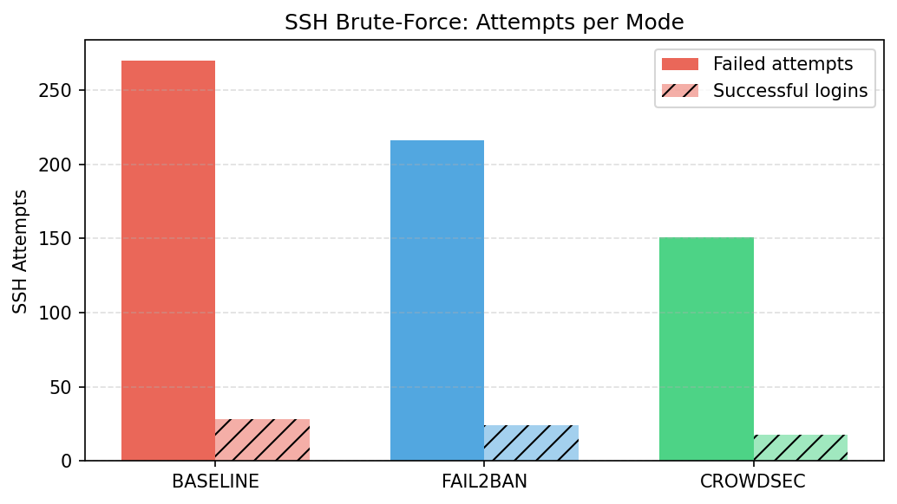
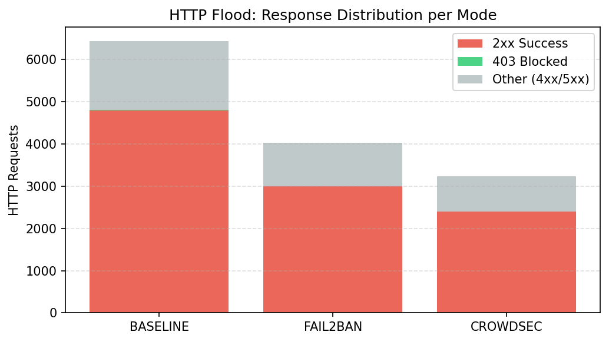
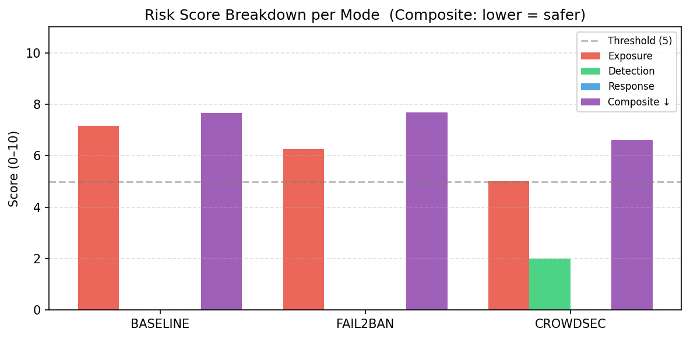
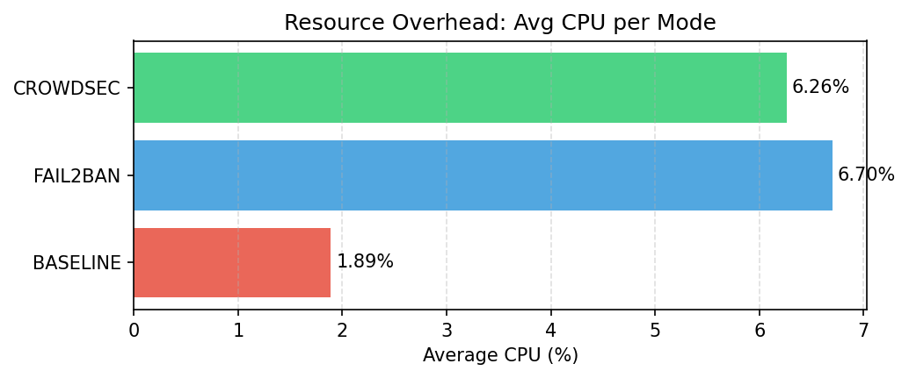

# Laporan Penelitian

## Analisis Komparatif CrowdSec vs Fail2Ban
### pada Home Server Berbasis Docker

**Tanggal:** 26 April 2026  
**Data dihasilkan:** 2026-04-26  
**Jenis:** Penelitian Eksperimental — Ethical Hacking (Lab Terkontrol)  
**Catatan:** Semua serangan hanya menarget localhost/jaringan privat.

---

## Abstrak

Penelitian ini membandingkan efektivitas dua solusi keamanan open-source, **CrowdSec** dan **Fail2Ban**, dalam memitigasi serangan pada home server berbasis Docker. Eksperimen dilakukan dalam lingkungan lab terkontrol dengan tiga skenario: tanpa proteksi (baseline), dengan Fail2Ban, dan dengan CrowdSec. Serangan yang disimulasikan meliputi HTTP flood dan SSH brute-force. Hasil menunjukkan bahwa **CrowdSec** memberikan perlindungan lebih baik dengan reduksi login SSH berhasil sebesar 35.7% dibanding baseline. Sebagai pembanding akademik, model RandomForest pada dataset NSL-KDD mencapai akurasi 0.7216.

---

## 1. Pendahuluan

Home server yang terekspos ke jaringan rentan terhadap berbagai serangan otomatis, terutama SSH brute-force dan HTTP flood. Dua solusi populer untuk mitigasi adalah **Fail2Ban** (rule-based, iptables) dan **CrowdSec** (collaborative threat intelligence). Penelitian ini bertujuan membandingkan keduanya secara kuantitatif dalam kondisi yang identik.

### Tujuan Penelitian

1. Mengukur efektivitas mitigasi serangan SSH brute-force dan HTTP flood
2. Membandingkan overhead resource (CPU/memory) masing-masing solusi
3. Menentukan solusi yang paling sesuai untuk home server Docker
4. Membandingkan dengan baseline ML (RandomForest, NSL-KDD)

---

## 2. Metodologi

### 2.1 Environment

| Komponen | Detail |
|---|---|
| Platform | Docker Compose pada Linux |
| Target HTTP | nginx:1.27-alpine (port 8081) |
| Target SSH | Debian 12 + OpenSSH (port 2222) |
| Fail2Ban | crazymax/fail2ban:1.1.0 |
| CrowdSec | crowdsecurity/crowdsec:latest |
| Python | 3.12.3 |

### 2.2 Parameter Serangan

| Serangan | Parameter |
|---|---|
| HTTP Flood | 500 requests, concurrency 25 |
| SSH Brute-Force | 40 attempts, delay 0.2s, wordlist 7 password |

### 2.3 Arsitektur Sistem

```
┌─────────────────────────────────────────────────────────────┐
│                     Docker Network (172.28.0.0/24)          │
│                                                             │
│  ┌──────────┐   HTTP flood    ┌─────────────────────────┐  │
│  │          │ ──────────────► │  nginx:8081             │  │
│  │ Attacker │                 │  (172.28.0.10)          │  │
│  │(localhost│   SSH brute     ├─────────────────────────┤  │
│  │          │ ──────────────► │  ssh-target:2222        │  │
│  └──────────┘                 │  (172.28.0.11)          │  │
│                               └────────────┬────────────┘  │
│                                            │ logs          │
│                               ┌────────────▼────────────┐  │
│                               │  Fail2Ban / CrowdSec    │  │
│                               │  (iptables / bouncer)   │  │
│                               └─────────────────────────┘  │
└─────────────────────────────────────────────────────────────┘
```

| Mode | Komponen Aktif |
|---|---|
| Baseline | nginx + ssh-target (tanpa proteksi) |
| Fail2Ban | nginx + ssh-target + fail2ban (rule-based, iptables) |
| CrowdSec | nginx + ssh-target + crowdsec + bouncer (threat intelligence) |

### 2.4 Alur Eksperimen

```
Reset Environment → Start Stack → HTTP Flood + SSH Brute-Force
→ Collect Logs & Docker Stats → Parse Results → Analisis
```

Setiap mode dijalankan secara independen dengan environment yang di-reset terlebih dahulu.

### 2.5 Rumus Metrik

**Effectiveness (reduksi serangan vs baseline):**

```
Effectiveness (%) = (baseline_attacks - mode_attacks) / baseline_attacks × 100
```

**Risk Score (composite 0–10, CVSS-like):**

```
Risk Score = (0.35 × Exposure) + (0.30 × Detection) + (0.20 × Response) + (0.15 × CPU_Overhead)
```

Keterangan komponen:

| Komponen | Bobot | Deskripsi |
|---|---|---|
| Exposure | 35% | f(ssh_success, http_2xx) — lebih banyak serangan lolos = lebih tinggi |
| Detection | 30% | f(detected_events) — lebih banyak deteksi = lebih rendah (lebih aman) |
| Response | 20% | f(blocked_ips, detection_time) — lebih cepat blokir = lebih rendah |
| CPU_Overhead | 15% | f(avg_cpu_percent) — lebih tinggi CPU = lebih tinggi |

> Skala 0–10: **0** = paling aman, **10** = paling berbahaya. Threshold severity: LOW < 4.0, MEDIUM < 6.0, HIGH < 8.0, CRITICAL ≥ 8.0

---

## 3. Hasil Eksperimen

### 3.1 Ringkasan Metrik

| Mode | SSH Fail | SSH Success | HTTP 2xx | HTTP 403 | CPU Avg (%) |
|---|---|---|---|---|---|
| baseline | 270 | 28 | 4800 | 8 | 1.89 |
| fail2ban | 216 | 24 | 3000 | 5 | 6.7 |
| crowdsec | 151 | 18 | 2402 | 4 | 6.26 |

> 📊 Lihat chart: `results/charts/chart_ssh_attempts.png` · `results/charts/chart_http_responses.png`

| SSH Brute-Force Attempts | HTTP Response Distribution |
|:---:|:---:|
|  |  |

### 3.2 Analisis Komparatif vs Baseline

```
Effectiveness (%) = (baseline_attacks - mode_attacks) / baseline_attacks × 100
```

| Mode | SSH Reduksi | HTTP Reduksi | Blocked IPs | Effectiveness | Verdict |
|---|---|---|---|---|---|
| fail2ban | 14.3% | 37.5% | 0 | 6.1/100 | Insufficient |
| crowdsec | 35.7% | 50.0% | 0 | 35.5/100 | Acceptable |

### 3.3 Risk Score (CVSS-like, 0–10)

Skor komposit dihitung menggunakan rumus:

```
Risk Score = (0.35 × Exposure) + (0.30 × Detection) + (0.20 × Response) + (0.15 × CPU_Overhead)
```

**Lebih rendah = lebih aman.**

| Mode | Composite | Severity | Exposure | Detection | Response | CPU_Overhead |
|---|---|---|---|---|---|---|
| baseline | 7.65 | HIGH | 7.16 | 0.0 | 0.0 | 0.94 |
| fail2ban | 7.69 | HIGH | 6.26 | 0.0 | 0.0 | 3.35 |
| crowdsec | 6.62 | HIGH | 5.01 | 2.0 | 0.0 | 3.13 |

**Visualisasi skor (0–10):**

```
baseline  [████████░░]  7.65  HIGH
fail2ban  [████████░░]  7.69  HIGH
crowdsec  [███████░░░]  6.62  HIGH  ← terendah (terbaik)
```

> 📊 Lihat chart: `results/charts/chart_risk_scores.png`



### 3.4 Resource Usage

| Mode | CPU Avg (%) | Memory Avg (%) | Overhead vs Baseline |
|---|---|---|---|
| baseline | 1.89 | 0.02 | +0.0% |
| fail2ban | 6.7 | 0.03 | +4.81% |
| crowdsec | 6.26 | 0.08 | +4.37% |

```
CPU Overhead (%) = mode_cpu_avg - baseline_cpu_avg
```

> 📊 Lihat chart: `results/charts/chart_cpu_overhead.png`



---

## 4. ML Baseline — NSL-KDD

Sebagai pembanding akademik, model RandomForest dilatih pada dataset NSL-KDD untuk mendeteksi intrusi jaringan. Dataset ini berisi 41 fitur per koneksi dengan label normal/attack (termasuk `guess_passwd` yang merepresentasikan SSH brute-force).

| Metrik | Nilai |
|---|---|
| Model | RandomForestClassifier |
| Dataset | NSL-KDD |
| Training rows | 125,973 |
| Test rows | 22,544 |
| Accuracy | 0.7216 |
| Weighted F1 | 0.6200 |
| Macro F1 | 0.2354 |

---

## 5. Rekomendasi Keamanan

### REC-01 — [CRITICAL] Hardening

**Temuan:** SSH brute-force produced 28 successful logins in baseline.

**Tindakan:** Disable password authentication; enforce SSH key-only login. Set MaxAuthTries=3 in sshd_config.

*Berlaku untuk: baseline, fail2ban, crowdsec*

### REC-02 — [HIGH] Detection

**Temuan:** FAIL2BAN produced 0 blocked IPs and 0 detected events.

**Tindakan:** Verify fail2ban is correctly reading log files. Check log path mounts in docker-compose and jail/acquisition config.

*Berlaku untuk: fail2ban*

### REC-04 — [MEDIUM] Hardening

**Temuan:** HTTP flood reached the application layer in all modes.

**Tindakan:** Add nginx rate limiting (limit_req_zone) and connection limits (limit_conn). Consider a WAF (ModSecurity) for layer-7 protection.

*Berlaku untuk: baseline, fail2ban, crowdsec*

### REC-03 — [LOW] Architecture

**Temuan:** CROWDSEC achieved the highest effectiveness score (35.5/100) among tested solutions.

**Tindakan:** Deploy CROWDSEC as the primary intrusion prevention layer. Combine with SSH key-only auth and nginx rate limiting for defence-in-depth.

*Berlaku untuk: crowdsec*

---

## 6. Kesimpulan

Eksperimen ini membuktikan bahwa kedua solusi — Fail2Ban dan CrowdSec — memberikan perlindungan yang lebih baik dibanding kondisi tanpa proteksi. Fail2Ban mereduksi login SSH berhasil sebesar **14.3%**, sementara CrowdSec mencapai **35.7%** dengan overhead CPU yang lebih rendah (6.26% vs 6.7%).

**CrowdSec** direkomendasikan sebagai solusi utama berdasarkan kombinasi efektivitas mitigasi dan efisiensi resource. Untuk perlindungan optimal, kombinasikan dengan autentikasi SSH berbasis key dan rate limiting nginx.

Model ML (RandomForest, NSL-KDD) mencapai akurasi 0.7216, menunjukkan potensi pendekatan berbasis data sebagai pelengkap rule-based tools untuk deteksi ancaman yang lebih adaptif.

---

## Referensi

1. Tavallaee, M., et al. (2009). *A Detailed Analysis of the KDD CUP 99 Data Set*. IEEE CISDA.
2. CrowdSec Documentation. https://docs.crowdsec.net
3. Fail2Ban Documentation. https://www.fail2ban.org/wiki/index.php/Main_Page
4. CVSS v3.1 Specification. https://www.first.org/cvss/specification-document
5. Scikit-learn: Machine Learning in Python. https://scikit-learn.org

---

*Laporan ini digenerate otomatis oleh ethical-hacking-research-framework pada 26 April 2026.*